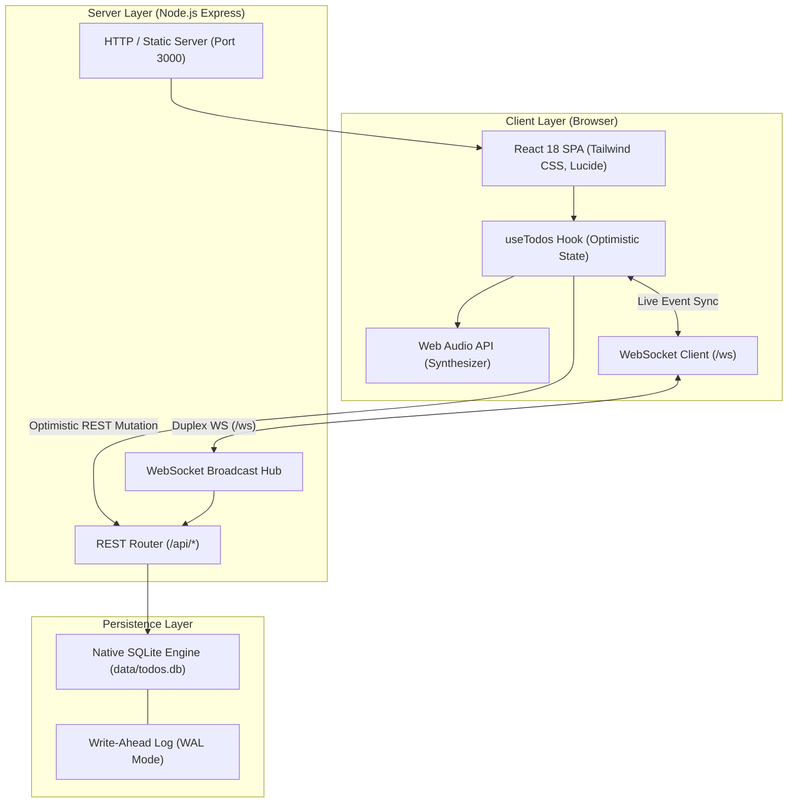
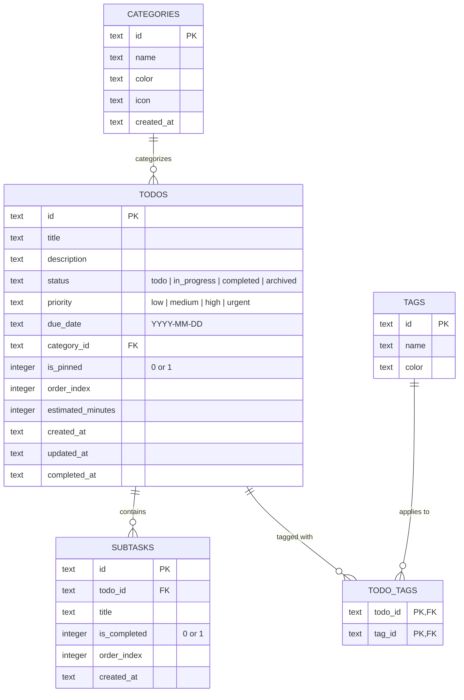

# System Design Document: TaskFlow

**Product**: TaskFlow — Modern Dynamic Full-Stack Todo & Productivity Platform  
**Target Directory**: `C:\Arti\Data Mining\Projects with Antigravity\fullstack-test`  
**Author**: Antigravity  
**Status**: Implemented & Verified  
**Date**: September 2026  

---

## 1. Executive Summary & Goals

TaskFlow is designed to bridge the gap between traditional lightweight todo apps (which lack structure, real-time collaboration, and analytics) and heavy enterprise project management tools like Jira (which are slow and cumbersome). 

### Key Objectives
- **Zero-Latency Interaction**: Optimistic UI updates with instant local feedback and server reconciliation.
- **Keyboard-First Workflow**: Command palette (`Ctrl+K` / `Cmd+K`) and single-key shortcuts (`N`, `/`, `1`, `2`, `3`, `D`, `?`) inspired by Linear and Superhuman.
- **Real-Time Cross-Tab Sync**: Bi-directional WebSocket communication keeping all windows and devices synchronized without manual refreshes.
- **Zero-Friction Infrastructure**: Persistent relational storage utilizing Node.js's native `node:sqlite` engine with WAL mode—eliminating external database servers and native C++ toolchain dependencies.

---

## 2. High-Level Architecture

TaskFlow adopts a unified full-stack architecture. The Node.js Express server acts as both the REST/WebSocket API provider and the static asset host for the compiled React SPA.



---

## 3. Data Model & Storage Design

The database uses SQLite 3 via Node.js's built-in `node:sqlite` module (`DatabaseSync`). Foreign keys are strictly enforced, and Write-Ahead Logging (`PRAGMA journal_mode = WAL;`) enables concurrent reads and writes.



### Indexing Strategy
- `idx_todos_status`: Accelerates Kanban column filtering and status preset queries.
- `idx_todos_priority`: Speeds up high-impact and urgent task retrieval.
- `idx_todos_category`: Accelerates category grouping and aggregate count queries.
- `idx_todos_order`: Supports deterministic reordering in list and board views.
- `idx_todos_due_date`: Enables fast deadline queries (overdue, today, upcoming).
- `idx_subtasks_todo`: Optimizes subtask hydration and cascade deletes.

---

## 4. API & WebSocket Protocol

### 4.1 REST Endpoints

| Resource | Method | Path | Description |
| :--- | :--- | :--- | :--- |
| **Health** | `GET` | `/api/health` | System uptime and health check. |
| **Tasks** | `GET` | `/api/todos` | Filterable list (`status`, `priority`, `category_id`, `search`, `sort`). |
| | `POST` | `/api/todos` | Create task, hydrates subtasks and tags. |
| | `GET` | `/api/todos/:id` | Retrieve single task with subtasks. |
| | `PUT` | `/api/todos/:id` | Update task fields, completion state, or priority. |
| | `DELETE` | `/api/todos/:id` | Cascade delete task. |
| | `POST` | `/api/todos/:id/duplicate` | Clone task with all subtasks and tags. |
| | `POST` | `/api/todos/reorder` | Batch reorder task sequence. |
| | `POST` | `/api/todos/bulk` | Bulk actions (`complete_all`, `delete_completed`). |
| **Subtasks**| `POST` | `/api/todos/:id/subtasks` | Append a checklist item. |
| | `PUT` | `/api/todos/:id/subtasks/:stId` | Toggle or rename checklist item. |
| | `DELETE` | `/api/todos/:id/subtasks/:stId` | Remove checklist item. |
| **Metadata**| `GET` | `/api/categories` | Retrieve all categories and tags with counts. |
| | `GET` | `/api/stats` | Productivity metrics, streak days, and workload. |
| **Data** | `GET` | `/api/data/export/csv` | Download tasks as a spreadsheet CSV. |
| | `GET` | `/api/data/export/json` | Full JSON database backup. |
| | `POST` | `/api/data/import` | Database restoration from JSON backup. |

### 4.2 WebSocket Event Schema
When mutations occur, the server broadcasts JSON messages over `/ws`:

```json
{
  "type": "TODO_CREATED | TODO_UPDATED | TODO_DELETED | TODOS_REORDERED | TODOS_BULK_UPDATED",
  "data": { ... },
  "timestamp": "2026-09-05T03:00:00.000Z"
}
```

Clients subscribe to these events and silently update local React state if the mutation originated from another tab or user session.

---

## 5. Frontend & Interaction Architecture

### 5.1 View Layer Decomposition
1. **`Navbar`**: Persistent top header with brand icon, WebSocket live connectivity indicator, view mode switcher (`[1]`, `[2]`, `[3]`), search launcher, theme switcher, sound toggle, and keyboard shortcuts guide.
2. **`FilterBar`**: Status pill bar (*All*, *To Do*, *In Progress*, *Completed*), category picker, sort controller, and bulk operations menu.
3. **`ListView`**: Linear view separating *Pinned Focus* tasks from standard items, with drag-and-drop manual ordering.
4. **`KanbanView`**: Three-column workflow (*To Do*, *In Progress*, *Done*) with native HTML5 drag-and-drop between columns.
5. **`AnalyticsView`**: Productivity dashboard showing completion percentage, active streak days, estimated vs. actual focus hours, category load distributions, and priority workload.
6. **`TaskModal`**: Full task creation and editing modal supporting markdown notes, subtask checklists, and custom tags.
7. **`CommandPalette`**: Global `Ctrl+K` spotlight modal for instant fuzzy search, navigation, and bulk actions.
8. **`ToastContainer`**: Bottom-right floating toasts equipped with a 5-second **Undo** action for deletions.

### 5.2 Micro-Interactions & Sensory Feedback
- **Synthesized Audio (Web Audio API)**: Instead of downloading MP3 files, task completion generates a 4-note ascending major arpeggio (C5 $\rightarrow$ E5 $\rightarrow$ G5 $\rightarrow$ C6) directly through browser audio oscillators with exponential gain decay.
- **Milestone Confetti**: When all active tasks are completed or large milestones are reached, a 200-particle canvas confetti burst triggers.
- **Optimistic UI with Rollback**: Status toggles and deletions update the interface in 0ms. If the server request fails, the local state automatically rolls back to the previous snapshot and alerts the user.

---

## 6. Performance & Security Considerations

- **SQL Injection Prevention**: All queries in `server/db.js` and route handlers use parameterized prepared statements (`db.prepare('... WHERE id = ?').run(...)`).
- **XSS & Content Security**: React's JSX prevents unescaped HTML injection in titles and descriptions.
- **Resource Footprint**:
  - The SQLite database file resides in `data/todos.db` and operates in WAL mode, preventing database file locks.
  - Zero external runtime server dependencies (like Redis, PostgreSQL, or Mongo) are needed.
- **CSS Optimization**: Tailwind CSS purges unused utility classes during `vite build`, resulting in a tiny 39KB minified CSS bundle.

---

## 7. Deployment & Execution Models

- **Unified Production Mode (`npm start` or `start.bat`)**:
  Express serves the API endpoints under `/api/*` and acts as a single-page application server for `client/dist`, listening on port `3000`.
- **Development Mode (`npm run dev` or `dev.bat`)**:
  `scripts/dev.js` orchestrates both the Express backend (port 3000) and the Vite hot-reloading server (port 5173 with proxy configuration).
